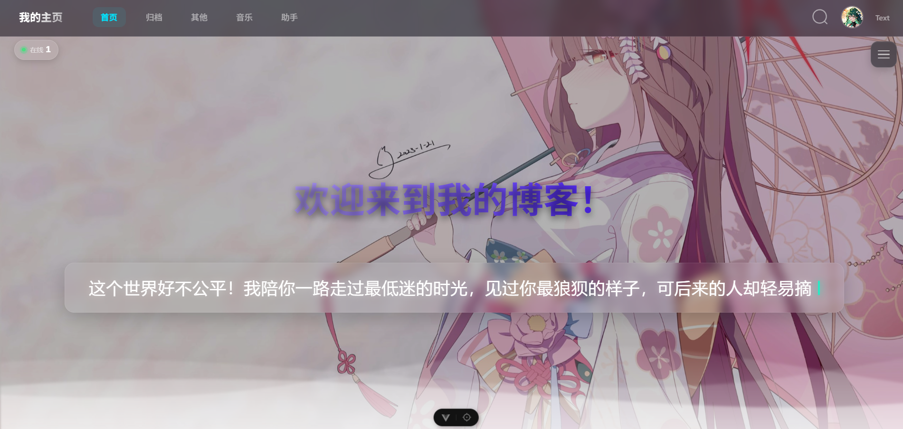
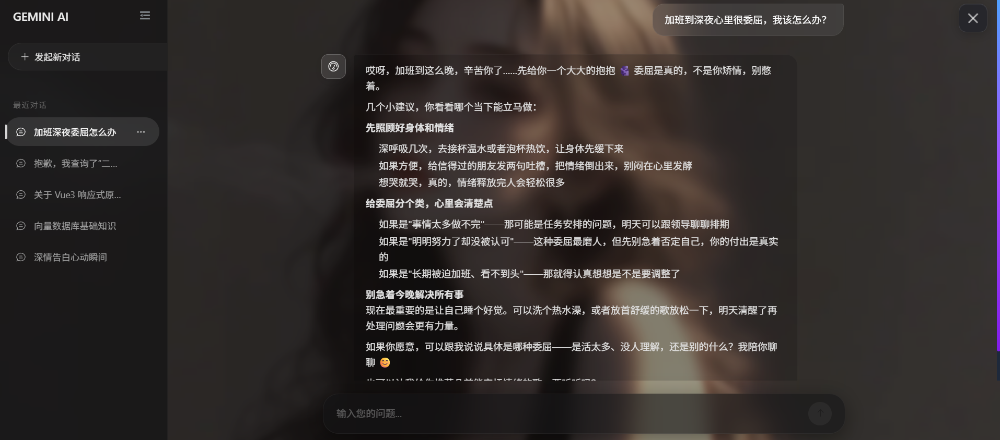
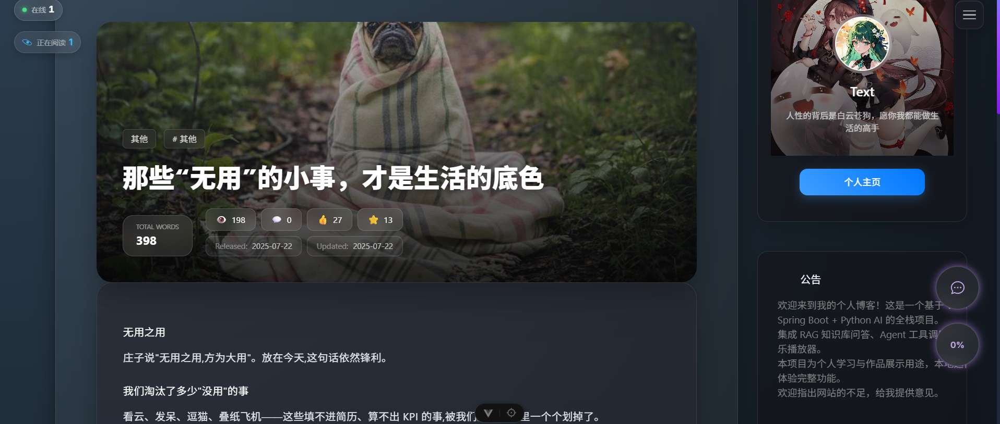

<div align="center">

# My Blog · 全栈博客系统

> 基于 Vue 3 + Spring Boot + Python AI 的现代化全栈博客平台，集成 Agentic RAG、ReAct Agent、实时通讯与微前端音乐播放器，支持 Docker Compose 一键容器化部署
</div>

<div align="center">

> 📌 **本项目为个人学习 / 作品展示用途**，未部署到公网，**本地运行即可体验完整功能**。

</div>

<p align="center">
  
  
  
  
  
  
  
  
  
  
  
  
</p>

---

## 📝 项目简介

**一句话定义**：一个把"博客内容消费 → AI 智能问答 → 实时互动"端到端打通的全栈项目。

**背景与解决的问题**：传统的博客系统通常只解决"内容发布"这一件事，AI 问答往往与业务数据割裂。本项目想验证一个问题——能否让 AI 助手真正"读懂"博客内容、并能主动调用业务接口回答用户问题？因此采用了 **RAG 检索增强 + ReAct Agent 工具调用** 的双轨架构，并配合多语言微服务（Java 主业务 + Python AI 服务）+ 微前端（博客主应用 + 音乐子应用）的方式落地。整个过程涉及向量检索、流式推理、实时通讯、多数据库协同等典型后端工程难题，是一份覆盖前后端完整链路的练手作品。

---

## 🛠 技术栈

### 前端（博客主应用 + 音乐微前端子应用）

| 类别 | 选型 |
| --- | --- |
| 框架 | Vue 3.5 + TypeScript + Vite 7 |
| 状态管理 | Pinia |
| UI 组件 | Element Plus + shadcn-vue (reka-ui) + Lucide Icons + Font Awesome |
| 样式 | Tailwind CSS 4 + Less + 玻璃拟态设计 |
| 动效 | GSAP + ScrollTrigger + Three.js + motion-v |
| 实时通讯 | Socket.IO Client |
| 微前端 | Micro-app |
| 流式响应 | @microsoft/fetch-event-source |
| 安全 | DOMPurify（XSS 防护） |
| Markdown | marked |
| Mock | MSW（Mock Service Worker） |
| 规范 | ESLint + Oxlint |

### 后端 · Java 主业务服务

| 类别 | 选型 |
| --- | --- |
| 框架 | Spring Boot 3.5（Java 24） |
| 关系型数据库 | MySQL + MyBatis-Plus |
| 文档数据库 | MongoDB + Spring Data MongoDB |
| 缓存 | Redis + Spring Data Redis |
| 实时通讯 | Socket.IO（netty-socketio 2.0.x） |
| 认证 | JWT（jjwt）+ BCrypt + Refresh Token 轮换（Redis 黑名单） |
| 校验 | Spring Validation |
| 工程 | Lombok |

### 后端 · Python AI 微服务

| 类别 | 选型 |
| --- | --- |
| 框架 | FastAPI + Uvicorn |
| AI 框架 | LangChain（langchain-openai，OpenAI 兼容协议） |
| 对话模型 | OpenAI 兼容 API（默认 DeepSeek，.env 可切换任意兼容服务） |
| 向量化 / 重排 | sentence-transformers 本地进程内推理：google/embeddinggemma-300m（Embedding）+ cross-encoder/ms-marco-MiniLM-L-6-v2（Reranker） |
| 向量库 | Qdrant |
| 异步 MongoDB | Motor（Async PyMongo） |
| 流式响应 | SSE（sse-starlette） |
| 跨服务调用 | httpx（同步 HTTP 调用 Java REST API） |

---

## ✨ 功能特性

### 内容创作与管理
- **文章系统**：文章流 / 详情 / 随机推荐，Markdown 渲染 + 分类 / 标签归档
- **互动体系**：文章点赞 / 收藏 / 评论（登录用户）
- **时间轴**：按发布时间线展示历史文章
- **搜索**：关键词搜索（标题正则匹配）+ 热门标题推荐（按浏览量排序）

### AI 智能助手（核心亮点）
- **Agentic RAG 知识库问答**：RAG 检索封装为 Agent 工具，模型自主决定"是否检索、用什么关键词检索"，回答"博客里写过什么"
- **ReAct Agent 工具调用**：集成 6 大业务域 27 个工具（文章、知识库、音乐、标签分类、社区动态、点赞收藏），基于原生 Function Calling，单轮并行多工具调用
- **流式输出**：token 级别实时推送，首字延迟低
- **多轮对话**：上下文连续 + 标题自动生成 + 历史记录游标分页

### 实时互动
- **树洞弹幕**：匿名发送 + 玻璃拟态 UI + 弹幕浮动动画
- **阅读房间**：进入文章详情时显示"当前 X 人正在阅读"
- **在线统计**：全站在线用户数实时广播

### 音乐播放器（微前端子应用）
- 歌单管理 / 收藏 / 歌曲点赞排行榜
- LRC 歌词解析与同步展示
- 歌词文件上传（.lrc 格式）

### 用户体系
- 注册 / 登录（支持用户名或邮箱）/ 邮箱找回密码
- JWT 双 Token（Access + Refresh）：Refresh Token 每次刷新自动轮换，旧 Token 进 Redis 黑名单，新 refreshToken 经 HttpOnly Cookie 下发
- 个人中心与资料管理

---

## 🎯 项目亮点

### 1. Agentic RAG · 让 AI 真正"读懂"博客内容
**做了什么**：将文章按 Markdown 标题智能分块（超长段落滑动窗口回退）→ 本地 Embedding 模型向量化 → 存入 Qdrant；把检索封装为 Agent 的一个工具（Agentic RAG），由模型自主决定检索时机与关键词，检索时执行「Qdrant 粗召回 Top-15（相似度阈值预过滤）→ Reranker 融合精排（Reranker 70% + 原始分数 30%）取 Top-5」两阶段流程，并拼接最近 3 轮用户问题增强上下文相关性。
**带来的效果**：AI 助手基于博客真实内容回答问题，避免大模型幻觉；"模型自主检索"让闲聊不触发检索、内容问题自动改写关键词重试，检索命中更准、调用更省。

### 2. ReAct Agent 架构 · 让 AI 主动调用业务接口
**做了什么**：基于 LangChain 原生 Function Calling 构建 ReAct（Reasoning + Acting）Agent，集成 27 个业务工具（文章搜索、知识库问答、歌曲排行榜、歌单、标签/分类、时间轴、树洞、每日名言、点赞/收藏等），支持单轮并行调用多个工具，最多 5 轮推理收敛，超轮次强制总结兜底。
**带来的效果**：AI 助手不仅会"读"，还会"做"——能直接查询当前热门歌曲、最新文章、用户互动数据，甚至帮登录用户点赞收藏，把静态博客变成可对话、可操作的智能站点。

### 3. 多层 Redis 缓存 + 降级容错 · 性能与稳定性兼顾
**做了什么**：构建多层 Redis 缓存——Embedding 向量缓存（SHA-256 文本哈希作键，天然去重，TTL 24h）、RAG 检索结果缓存（TTL 1h）、Java 侧 Token 缓存与 Refresh Token 黑名单，并设计降级策略——Redis 异常时自动回退到直接计算。
**带来的效果**：避免重复执行本地模型推理与向量检索，显著降低响应延迟；即便缓存层故障，核心流程依然可用，不会被基础设施异常拖垮。

### 4. 三数据库协同 + 多语言微服务 · 复杂业务的真实工程实践
**做了什么**：MongoDB 存文档（文章 / 评论 / 树洞）、MySQL 存关系型用户数据、Qdrant 存向量；Java（Spring Boot）负责主业务、Python（FastAPI）负责 AI，二者通过 HTTP 同步调用 + SSE 流式推送协作。
**带来的效果**：每种数据落在最适合它的存储里，避免"一库打天下"的性能瓶颈；AI 与业务解耦，Python 服务可独立迭代而不影响主站稳定性。

### 5. 微前端 + Monorepo · 主应用与子应用解耦
**做了什么**：用 npm workspaces 管理 Monorepo，通过 Micro-app 把音乐播放器作为独立子应用集成进博客主应用，并实现跨应用 Token 共享。
**带来的效果**：音乐模块独立开发、独立部署，不污染主应用代码库；用户在博客与音乐间切换无需重新登录。

### 6. 流式 + 实时双通道通信 · 体验顺滑
**做了什么**：AI 回答用 SSE 流式推送（@microsoft/fetch-event-source + sse-starlette），实时互动用 Socket.IO（在线人数、阅读房间、弹幕）。
**带来的效果**：AI 回答像 ChatGPT 一样逐字出现，首字延迟低；阅读文章时能看到"还有谁在同时看这篇文章"，强化社区感。

### 7. Docker Compose 容器化 · 8 服务一键编排
**做了什么**：为前后端服务编写 Dockerfile（多阶段构建、依赖层缓存优化），用 Docker Compose 编排 8 个服务：MySQL / MongoDB / Redis / Qdrant / Java 后端 / Python AI 服务 / 博客主应用 / 音乐子应用；配置 healthcheck + 依赖启动顺序、数据卷持久化、`mysql-init.sql` 首次启动自动建库建表导入数据，前端由 nginx 统一托管并同源反向代理 API、Socket.IO 与子应用。
**带来的效果**：`docker compose up -d --build` 一条命令拉起整套系统，环境一致、开箱即用；健康检查保证服务按依赖顺序就绪，数据落卷重启不丢。

---

## 📸 功能展示

1.**首页**


2.**AI助手页面**


3.**对话**


4.**树洞弹幕**


5.**文章详情**


6.**时间轴**

---

## 🚀 快速开始

> ⚠️ **本项目未部署到公网，本地运行即可体验完整功能。**

### 环境要求

| 依赖 | 版本 | 用途 |
| --- | --- | --- |
| Node.js | `>= 20.19.0` | 前端构建 |
| Java | `24` | Java 后端运行 |
| Python | `>= 3.12` | Python AI 服务 |
| MongoDB | 7.x | 文档型数据存储（文章 / 评论 / AI 对话 / 树洞） |
| MySQL | 8.x | 关系型用户数据 |
| Redis | 最新稳定版 | 多层缓存 |
| Qdrant | 最新版 | 向量检索 |
| Docker + Docker Compose | 最新版 | 一键容器化部署（可选） |

### 1. 克隆仓库

```bash
git clone <your-repo-url>
cd my-fullstack-project
```

### 2. 配置环境变量

```bash
# Python AI 服务（对话模型 API Key、Qdrant / MongoDB / Redis 地址等）
cp backend/ai-service/.env.example backend/ai-service/.env
```

- **Python AI 服务**：在 `.env` 中填入 `LLM_API_KEY`（对话模型走 OpenAI 兼容 API，默认 DeepSeek，可切换任意兼容服务），其余连接地址按注释填写。
- **Java 后端**：[application.yml](backend/java-backend/src/main/resources/application.yml) 已含本地默认值；MySQL 密码与 JWT Secret 放在同目录的 `application-local.yml`（`local` profile 已默认激活，该文件含密钥请勿提交到 Git）。
- **前端**：[main-app/.env](frontend/main-app/.env) 已包含本地默认值（API / Socket 地址），开箱即用。

### 3. AI 模型说明（无需手动拉取）

- **对话模型**：走 API 调用，在 `.env` 填入 `LLM_API_KEY` 即可。
- **Embedding / Reranker 模型**：本地 sentence-transformers 进程内加载（首次调用自动从 HuggingFace 下载并缓存），国内可设置 `HF_ENDPOINT=https://hf-mirror.com` 加速下载。

### 4. 安装依赖

```bash
# 前端依赖（Monorepo 一键安装）
npm install

# Java 后端依赖（Maven 自动下载）
cd backend/java-backend && ./mvnw install && cd ../../..          # macOS / Linux
cd backend/java-backend; .\mvnw.cmd install; cd ..\..\..           # Windows PowerShell

# Python AI 服务依赖
cd backend/ai-service
python -m venv .venv312
.venv312/Scripts/pip install -r requirements.txt   # Windows
# .venv312/bin/pip install -r requirements.txt     # macOS / Linux
cd ../../..
```

### 5. 启动开发服务器

```bash
# 一键启动（每个服务独立窗口，关闭窗口即停止该服务；需 MongoDB / Redis / Qdrant 已在本地运行）
start.bat

# 或分别启动
cd frontend/main-app && npm run dev                              # 博客主应用
cd frontend/sub-apps/app-a && npm run dev                        # 音乐子应用
cd backend/java-backend && .\mvnw.cmd spring-boot:run            # Java 后端
cd backend/ai-service && .venv312\Scripts\python.exe -m uvicorn main:app --reload --port 8000   # Python AI 服务
```

启动后访问：

| 服务 | 地址 |
| --- | --- |
| 博客主应用 | http://localhost:5173 |
| 音乐子应用 | http://localhost:5175 |
| Java 后端 API | http://localhost:3001 |
| Socket.IO 服务 | http://localhost:3002 |
| Python AI 服务 | http://localhost:8000 |

### 6. 构建生产环境（可选）

```bash
# 构建前端
npm run build

# 构建 Java 后端 JAR
cd backend/java-backend && ./mvnw package                         # macOS / Linux
cd backend/java-backend; .\mvnw.cmd package                       # Windows PowerShell
```

### 7. Docker Compose 一键容器化部署（可选）

```bash
cp .env.docker.example .env    # 填好 MySQL 密码、JWT_SECRET 等
docker compose up -d --build   # 8 个服务一键编排启动
```

启动后访问 http://localhost —— nginx 统一入口，同源代理 Java API、Socket.IO 与音乐子应用；MySQL 通过 `mysql-init.sql` 首次启动自动建库建表，全部数据落卷持久化。

---

## 📂 目录结构

```
my-fullstack-project/
├── frontend/                          # 前端 Monorepo
│   ├── main-app/                      # 博客主应用（Vue 3）
│   │   └── src/
│   │       ├── views/                 # 页面视图（每个页面含 index.vue + useXxx.ts 逻辑分离）
│   │       │   ├── Home/              # 首页（文章流 + 信息面板）
│   │       │   ├── ArticleDetail/     # 文章详情
│   │       │   ├── AiChat/            # AI 智能助手
│   │       │   ├── Treehole/         # 树洞弹幕
│   │       │   ├── Timeline/          # 时间轴
│   │       │   └── ...
│   │       ├── components/            # 组件（app / business / layout / ui）
│   │       ├── composables/           # 组合式函数（表单校验、Socket、倒计时等）
│   │       ├── api/                   # Axios 封装
│   │       ├── stores/                # Pinia 状态管理
│   │       ├── socket/                # Socket.IO 客户端
│   │       └── directives/            # 自定义指令（v-lazy-bg 图片懒加载）
│   └── sub-apps/
│       └── app-a/                     # 音乐播放器微前端子应用
│           └── src/views/             # MusicHall / MusicPlayer / MyMusic / LyricsPage ...
│
├── backend/
│   ├── java-backend/                  # Spring Boot 主业务服务
│   │   └── src/main/java/com/example/demo/
│   │       ├── controller/            # REST 控制器（13 个）
│   │       ├── service/               # 业务逻辑层
│   │       ├── config/                # 配置（CORS / Redis / SocketIO / SecurityHeaders）
│   │       ├── websocket/             # Socket.IO 处理器
│   │       ├── middleware/             # JWT 鉴权中间件
│   │       └── common/                 # 统一响应 / 全局异常 / 限流
│   └── ai-service/                    # Python FastAPI AI 服务
│       ├── services/
│       │   ├── agent.py              # Agent 入口（聚合工具 + 流式运行）
│       │   ├── react_agent.py        # ReAct Agent 核心（原生 Function Calling）
│       │   ├── rag.py                # RAG 检索主流程（粗召回 + 精排 + 缓存）
│       │   ├── embedding.py          # 向量化服务（本地模型 + Redis 缓存）
│       │   ├── reranker.py           # Reranker 融合重排序
│       │   ├── article_chunk.py      # 文章分块与知识库管理
│       │   ├── chat.py               # 会话与消息持久化（MongoDB）
│       │   ├── evaluation.py         # RAG 检索质量评测（LLM-as-judge）
│       │   └── agent_evaluation.py   # Agent 层评测（100 用例 × 7 维度）
│       ├── tools/                     # Agent 工具定义（6 大业务域 27 个）
│       └── routers/                   # FastAPI 路由（chat / conversations / system）
│
├── docker-compose.yml                 # 8 服务容器化编排
├── mysql-init.sql                     # MySQL 容器首次启动自动初始化
├── start.bat                          # Windows 本地一键启动脚本
└── package.json                       # Monorepo 工作区配置
```

---

## 🔌 API 接口

> Java 后端统一返回 `ApiResponse<T>` 格式，全局异常处理由 `GlobalExceptionHandler` 兜底。

| 模块 | 关键端点 | 说明 |
| --- | --- | --- |
| 认证 | `POST /api/auth/register` `login` `reset-password` `refresh-token` `logout` | 注册 / 登录 / 重置密码 / 刷新令牌 / 登出 |
| 文章 | `GET /api/article` `GET /api/article/{id}` `POST /api/article/likes` `POST /api/article/collects` | 列表 / 详情 / 点赞收藏 |
| 评论 | `GET /api/article/{id}/comments` `POST /api/article/{id}/comments` | 评论查询与发布 |
| 分类标签 | `GET /api/categories` `GET /api/tags` | 分类与标签列表 |
| 树洞 | `POST /api/treehole` `GET /api/treehole` | 弹幕发送与拉取 |
| 搜索 | `GET /api/search?q=` `GET /api/search/hot-titles` | 关键词搜索 + 热门标题 |
| 歌曲歌单 | `GET /api/songs` `GET /api/playlists` | 音乐子应用数据（支持 multipart 歌词上传） |
| AI 对话 | `POST /api/chat/{id}`（SSE） | 流式 AI 对话，Java 网关转发 Python AI 服务 |
| 对话管理 | `GET /api/chat/conversations` `GET /api/chat/{id}/history` | 会话列表 / 历史消息（游标分页） |
| 用户 | `GET /api/profile` | 个人资料 / 收藏文章 |
| 时间轴 | `GET /api/timeline` | 按时间线查询文章 |

> 完整的接口字段定义请参考各 `Controller` 类的参数校验注解（Spring Validation）。

---

## 📊 性能与架构数据

| 维度 | 数据 / 设计 |
| --- | --- |
| RAG 检索召回 | Qdrant 向量召回 Top-15 候选（相似度阈值 0.5 预过滤） |
| RAG 精排 | Reranker 融合重排（Reranker 70% + 原始分数 30%），0.3 相关性阈值二次过滤后取 Top-5 |
| Embedding 缓存 | Redis 缓存向量，SHA-256 文本哈希作键，TTL 24 小时 |
| RAG 结果缓存 | 同一查询命中直接返回，TTL 1 小时 |
| Agent 收敛 | 原生 Function Calling，单轮并行多工具调用，最多 5 轮推理 + 强制总结兜底 |
| 文章分块策略 | Markdown 标题优先 → 滑动窗口（512 字符 / 50 重叠）回退 |
| 缓存降级 | Redis 异常时自动回退到直接计算，核心流程不中断 |
| 防并发 | 点赞 / 收藏计数采用 MongoDB `$inc` 原子更新 + 互动状态 upsert，避免竞态条件 |
| Token 安全 | Refresh Token 轮换 + Redis 黑名单（jti 作键），HttpOnly Cookie 下发 |

---

## 🧪 Agent 评测

AI 服务内置两层评测模块：[evaluation.py](backend/ai-service/services/evaluation.py)（RAG 检索质量，LLM-as-judge）与 [agent_evaluation.py](backend/ai-service/services/agent_evaluation.py)（Agent 工具选择评测），执行 `python -m services.agent_evaluation` 即可复现。

**评测设置**：100 条用例 × 7 个维度（单工具 / 知识库 RAG / 多工具并行 / 混淆判别 / 闲聊通用 / 参数组合 / 多轮上下文），期望工具全部被调用即判过，闲聊类用例要求零调用；评测使用独立 Agent 实例（temperature=0 保证可复现），与生产实例（temperature=0.7）隔离，并发 5 执行；回答质量由 LLM-as-judge（DeepSeek）打分。

**分类别结果**：

| 类别 | 用例数 | 工具选择准确率 | 平均推理轮数 |
| --- | --- | --- | --- |
| 单工具 | 38 | 100% | 1.37 |
| 知识库 RAG | 15 | 100% | 2.20 |
| 多工具并行 | 10 | 100% | 1.10 |
| 混淆判别 | 10 | 90% | 1.60 |
| 闲聊通用（零调用） | 17 | 88% | 0.12 |
| 参数组合 | 6 | 100% | 1.67 |
| 多轮上下文 | 4 | 100% | 1.75 |

**总指标**：

| 指标 | 结果 |
| --- | --- |
| 工具选择准确率 | 97.0%（97/100） |
| 闲聊误调率 | 11.8%（2/17） |
| 平均推理轮数 | 1.54（有工具调用的 85 例） |
| 平均端到端耗时 | 3817 ms |
| 平均相关性评分（LLM-as-judge） | 3.94 / 5 |

**失败用例分析**：混淆判别 1 例——「二次元脑洞分类下的文章都在写什么内容？」中"分类"是强引导，模型选择了分类工具而非知识库；闲聊误调 2 例——「帮我想个博客文章标题」模型查了标签/分类想参考博客风格、「如何提高英语口语？」泛话题误触文章搜索。混淆判别整体 9/10：仅一词之差（"找一下关于遗憾的文章列表" vs "作者是怎么描述遗憾的"）模型能稳定区分"查列表"与"问内容"。

---

## 🧪 RAG 检索质量评测

[evaluation.py](backend/ai-service/services/evaluation.py) 用同一组 18 个基于真实文章的查询（直接内容题 / 主题观点题 / 跨文章归纳题），对比三种生成模式：**RAG+重排序 / RAG 无重排序（纯向量召回）/ 无 RAG**。评测不走 Agent 以隔离 RAG 本身的差异，temperature=0 保证可复现，回答质量由 LLM-as-judge（DeepSeek）打分，`python -m services.evaluation` 可复现。

| 指标（18 查询平均） | RAG+重排序 | RAG 无重排序 | 无 RAG |
| --- | --- | --- | --- |
| 相关性评分 | 4.72 / 5 | 4.83 / 5 | 4.17 / 5 |
| 忠实度评分 | 4.20 / 5 | 4.27 / 5 | —（无参考资料可评） |
| 关键词命中率 | 97.2% | 97.2% | 88.9% |
| 幻觉回答数 | 2 / 18 | 1 / 18 | 0 / 18 |
| 引用编号数 | 4.94 | 5.00 | 0（无法溯源） |
| 平均检索+精排耗时 | 1431 ms | 17 ms | 0 |
| 平均生成耗时 | 9011 ms | 8039 ms | 12201 ms |

**结论**：

- **RAG 显著有效**：相关性 4.72+ vs 无 RAG 的 4.17，关键词命中 97.2% vs 88.9%，且回答带 `[1][2]` 编号引用可溯源到具体文章；有资料可依时生成反而更快（12201 ms → 9011 ms），减少无依据的发挥
- **重排序的收益在小语料上不显著**：0.5 相似度阈值预过滤后平均仅 1.56 个候选进入精排，两阶段检索退化近似"直通"，相关性差异（4.72 vs 4.83）在 judge 噪声范围内；这是当前语料规模（15 篇）下的真实瓶颈，语料增长后需复测
- **精排开销可控**：Reranker 平均 122 ms，若召回候选增多仍不会成为瓶颈

---

## 🔮 未来计划

- [ ] 接入 Elasticsearch 实现文章全文搜索（当前为 MongoDB 正则匹配）
- [ ] 补充单元测试与 E2E 测试覆盖
- [ ] GitHub Actions CI/CD 自动化流水线

---

## 📄 许可证

本项目采用 [MIT License](LICENSE) 开源协议。

> 本项目为个人学习 / 作品展示用途，所涉及的对话模型 API（默认 DeepSeek）等第三方服务需使用者自行配置账号与密钥。

<div align="center">

**如果这个项目对你有启发，欢迎 ⭐ Star 支持！**

</div>
